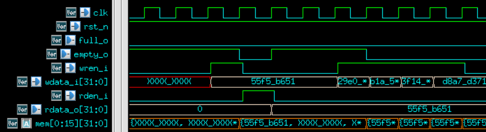

# Parameterized FIFO (First-In, First-Out)

## Overview

The parameterized FIFO is a data structure that allows data to be read and written in a sequential manner, ensuring that the first data written is the first data read out (hence "First-In, First-Out").

## Features

- **Parameterized Width and Depth**: Customize the bit-width and depth of the FIFO to suit specific application requirements.
- **Predictable Read Output**: When the `rden_i` signal is asserted, the data output (`rdata_o`) from the FIFO will be available on the subsequent clock cycle.

## Parameters

- `DATA_WIDTH`: The bit-width of the data to be stored in the FIFO.
- `DEPTH_LG2`: The logarithm base-2 of the number of data entries the FIFO can store.
- ``RST_MEM``: Determines the behavior of the memory reset. When set to 0, the memory will reset via the rst_n signal.
## Ports

- `clk`: Clock signal.
- `rst_n`: Reset signal.
- `wdata_i`: Data input port.
- `rdata_o`: Data output port.
- `wren_i`: Signal to enable data writing into the FIFO.
- `rden_i`: Signal to enable data reading from the FIFO.
- `full_o`: Indicator signaling the FIFO is full.
- `empty_o`: Indicator signaling the FIFO is empty.

## Behavioral Simulation

