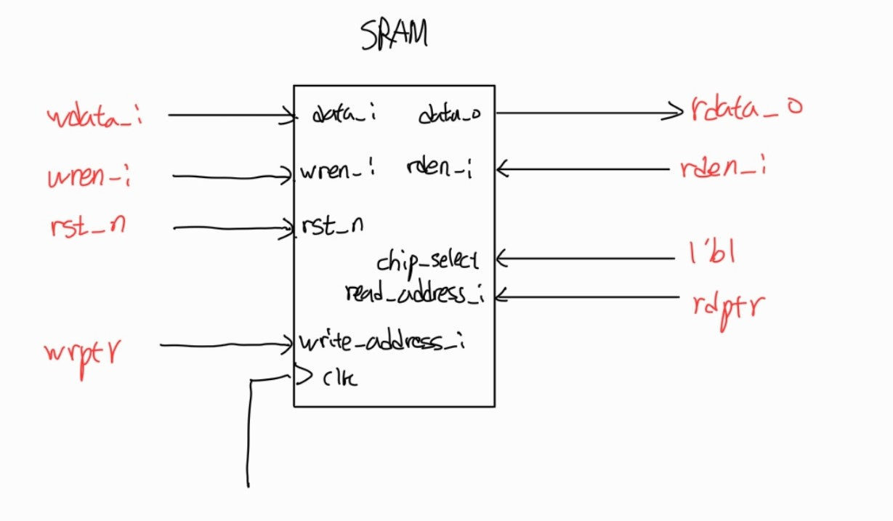
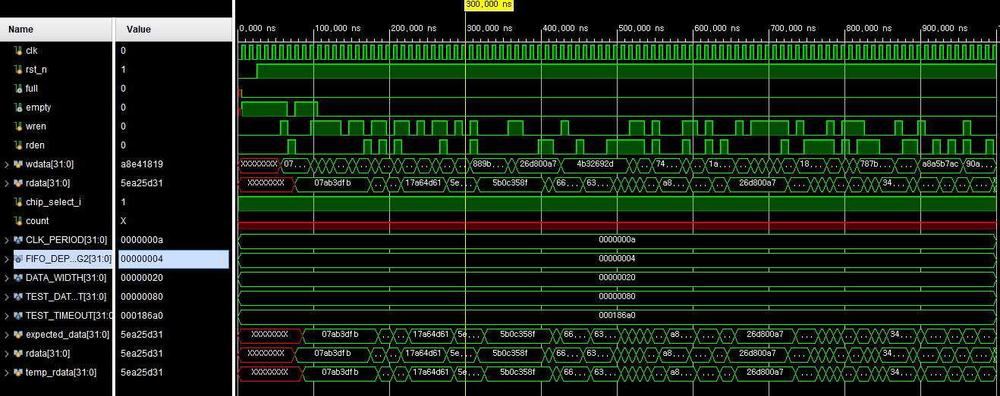
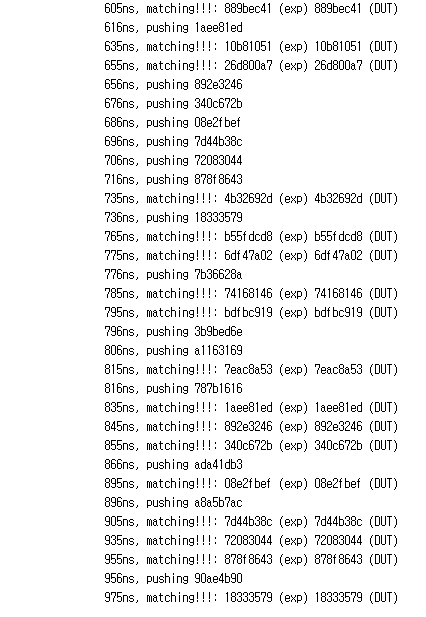

# SRAM-Based FIFO

- SRAM을 기반으로 한 FIFO
- SRAM의 동작원리를 기반으로 FIFO를 동작

## SRAM module

- SRAM에 address가 들어왔을 때, 해당 address를 쓰고 읽을 수 있음.
- address를 pointer로 만들어서 사용하면 FIFO로 동작 가능.

---

SRAM module

```verilog
module SRAM #(
    parameter       ADDRESS_DEPTH       =   8,
    parameter       DATA_WIDTH          =   32,
    parameter       DATA_DEPTH          =   16,
    parameter       RST_MEM             =   0
)
(   
    input   wire                        clk,
    input   wire [DATA_WIDTH-1:0]       data_i,
    input   wire [ADDRESS_DEPTH-1:0]    read_address_i,
    input   wire [ADDRESS_DEPTH-1:0]    write_address_i,
    output  reg [DATA_WIDTH-1:0]        data_o,
    input   wire                        wren_i,
    input   wire                        rden_i,
    input   wire                        rst_n
);

```

---

SRAM module 호출

```verilog
    SRAM #(.ADDRESS_DEPTH(DEPTH_LG2), .DATA_WIDTH(DATA_WIDTH), .DATA_DEPTH(FIFO_DEPTH), .RST_MEM(RST_MEM)) sram_memory 
    (
        .clk(clk), //clk
        .data_i(wdata_i), //write할 data
        .read_address_i(rdptr[DEPTH_LG2-1:0]), //read할 address
        .write_address_i(wrptr[DEPTH_LG2-1:0]), //write할 address
        .data_o(rdata_o), //read시 나오는 data
        .wren_i(wren_i), //wren
        .rden_i(rden_i), //rden
        .rst_n(rst_n) //reset
    );
```

---

<p align="center"></p>

- wren일 때, wrptr + 1
- rden일 때, rdptr + 1 

- rden일 때, rdata를 sram에 저장
- wren일 때, wdata를 sram에 저장


## 결과 화면 

<p align="center"></p>


<p align="center"></p>

<p align="center"></p>